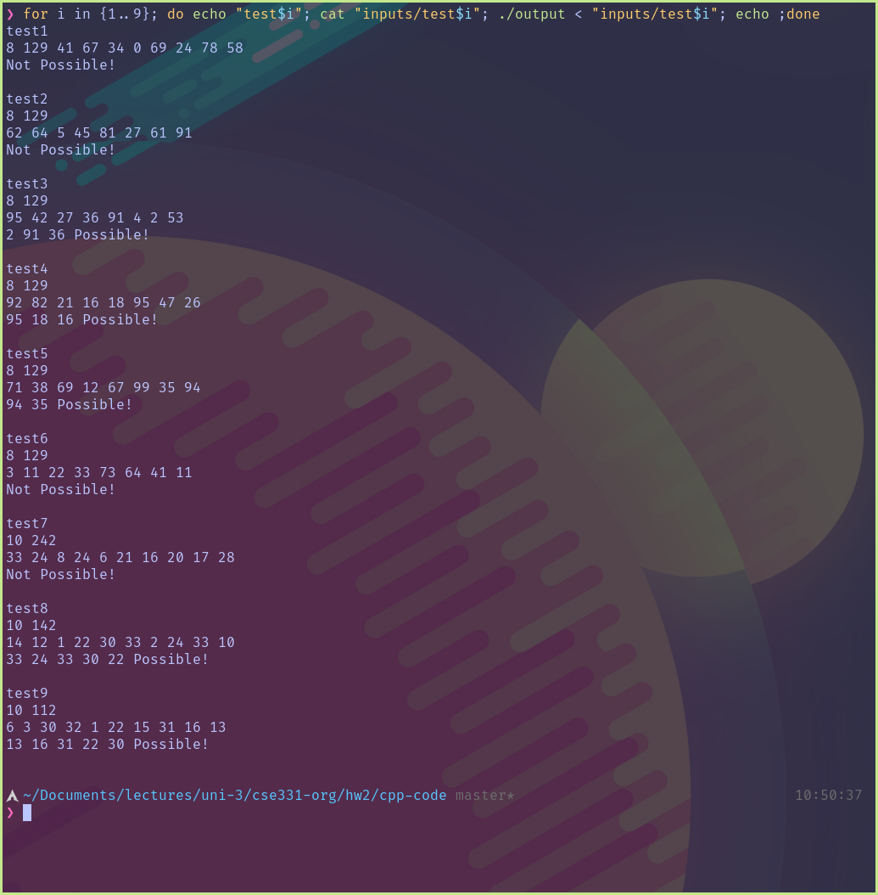
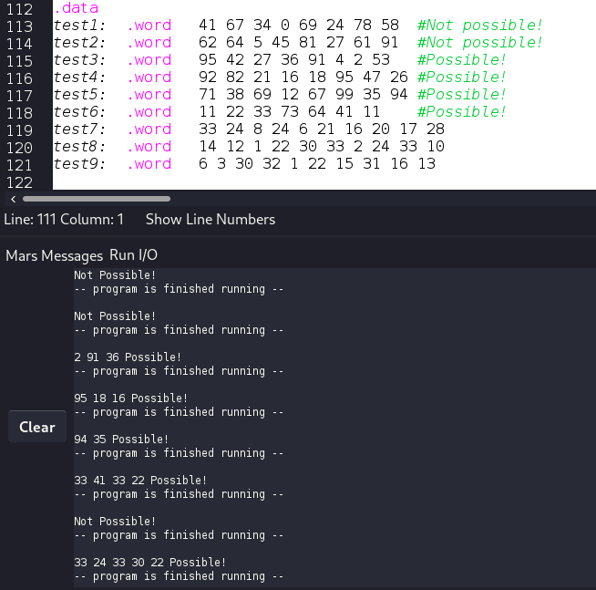

# Algorithm Explanation

**Inputs:** Array of elements along with its size and number to be checked  

**Output:** 1 if if sub elements of the array can sum up to this number, 0 otherwise.

If there are elements in the array can sum up to the number; an element can either be inclueded or excluded to this group. Therefore elements need to be checked until find a solution or there are no elements left. For any element there are 2 possibilities, inclueded or excluded.

Without optimization algorithm looks like;

---

    1. Check rest of the array without the element.
    2. Check rest of the array with the element.
    
    - Return 1 if summed values are equal to target number.
    - Return 0 if size exceed.

---

I have preferd to decrase the number, and check if it is 0. Instead of summing up.

## Optimzations

-   If summed number exceed to target number, it is pointless to keep adding. (In my case `num < 0`)
-   If element is equal to target or remaining value is equal the target then return 1.

I impemented the printing numbers in assembly. I did not store them in a structure, only print the screen when it is found.

**Note:** Results might not be the same with the pdf, but they are accurate. So, it might be slower or faster according to input data.

\newpage

# Test Cases

C++ code output:

\newpage

MARS output:

